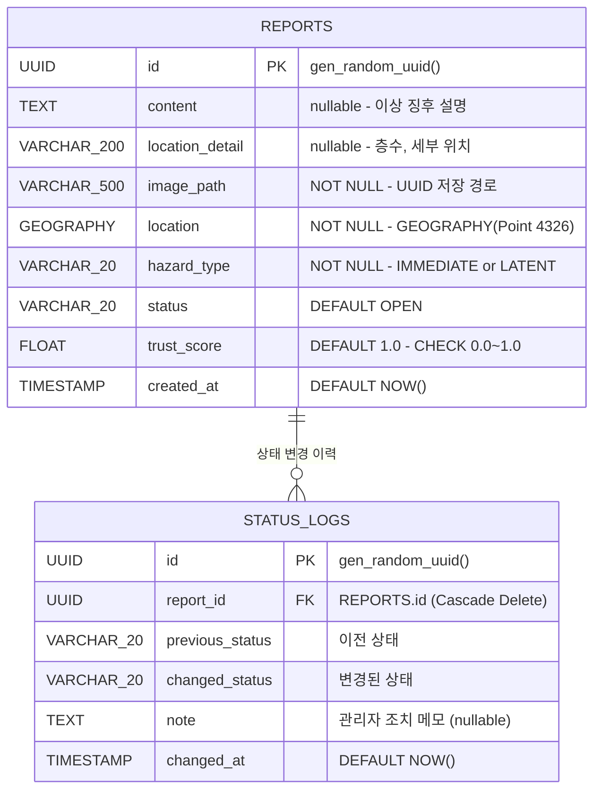

# ERD (Entity Relationship Diagram)

## 테이블 관계도



## 설계 근거

- **단일 reports 테이블**: 외래키 복잡도 없이 공간 연산에 집중
- **STATUS_LOGS 분리**: 상태 변경 감사 추적(Audit Trail) 구조
  - OPEN → IN_PROGRESS → RESOLVED 이력 전체 보존
  - 관리자가 언제 어떤 조치를 했는지 타임라인 제공
  - 관리자 대시보드 히스토리 기능으로 연결
- **USERS 테이블 미도입**: 익명 제보 원칙과 충돌하므로 제외
- **REPORT_IMAGES 미도입**: MVP는 사진 1장 단수 처리, 다중 사진은 후속 과제

## DDL

### reports 테이블

```sql
CREATE TABLE IF NOT EXISTS reports (
    id               UUID PRIMARY KEY DEFAULT gen_random_uuid(),
    content          TEXT,
    location_detail  VARCHAR(200),
    image_path       VARCHAR(500) NOT NULL,
    location         GEOGRAPHY(Point, 4326) NOT NULL,
    hazard_type      VARCHAR(20) NOT NULL
                     CHECK (hazard_type IN ('IMMEDIATE', 'LATENT')),
    status           VARCHAR(20) DEFAULT 'OPEN'
                     CHECK (status IN ('OPEN', 'IN_PROGRESS', 'RESOLVED')),
    trust_score      FLOAT DEFAULT 1.0
                     CHECK (trust_score >= 0.0 AND trust_score <= 1.0),
    created_at       TIMESTAMP DEFAULT NOW()
);
```

### status_logs 테이블

```sql
CREATE TABLE IF NOT EXISTS status_logs (
    id               UUID PRIMARY KEY DEFAULT gen_random_uuid(),
    report_id        UUID NOT NULL
                     REFERENCES reports(id) ON DELETE CASCADE,
    previous_status  VARCHAR(20),
    changed_status   VARCHAR(20) NOT NULL,
    note             TEXT,
    changed_at       TIMESTAMP DEFAULT NOW()
);
```

## 인덱스

```sql
-- 공간 쿼리용 GiST 인덱스
CREATE INDEX IF NOT EXISTS idx_reports_location
ON reports USING GIST(location);

-- 시간 윈도우 쿼리용 인덱스
CREATE INDEX IF NOT EXISTS idx_reports_created_at
ON reports(created_at);

-- OPEN/IN_PROGRESS 상태 조회 최적화 (부분 인덱스)
CREATE INDEX IF NOT EXISTS idx_reports_open
ON reports(status)
WHERE status != 'RESOLVED';

-- status_logs 조회 최적화
CREATE INDEX IF NOT EXISTS idx_status_logs_report_id
ON status_logs(report_id);
```

## 핵심 공간 쿼리

```sql
-- LATENT: 최근 30일, RESOLVED 제외
SELECT COUNT(*) FROM reports
WHERE ST_DWithin(location, :point, 50)
AND hazard_type = 'LATENT'
AND status != 'RESOLVED'
AND created_at > NOW() - INTERVAL '30 days';

-- IMMEDIATE: OPEN 상태만
SELECT COUNT(*) FROM reports
WHERE ST_DWithin(location, :point, 50)
AND hazard_type = 'IMMEDIATE'
AND status = 'OPEN';

-- 뷰포트 필터링
SELECT * FROM reports
WHERE ST_DWithin(location, :point, :radius)
AND status != 'RESOLVED';

-- IMMEDIATE 중복 체크 (반경 10m)
SELECT COUNT(*) FROM reports
WHERE ST_DWithin(location, :point, 10)
AND hazard_type = 'IMMEDIATE'
AND status = 'OPEN';

-- 특정 제보의 상태 변경 이력 조회
SELECT * FROM status_logs
WHERE report_id = :report_id
ORDER BY changed_at ASC;
```

## 위험도 산출 방식 (Stateless)

위험도(`riskLevel`)는 `reports` 테이블에 저장하지 않습니다.
`GET /api/layers` 요청 시 PostGIS `ST_DWithin` 쿼리로 실시간 계산됩니다.

### 산출 규칙

| 트랙 | 조건 | riskLevel |
|------|------|-----------|
| IMMEDIATE | hazard_type = 'IMMEDIATE', status = 'OPEN' | CRITICAL (즉시) |
| LATENT | 반경 50m, 최근 30일, status != 'RESOLVED', count 0 | SAFE |
| LATENT | 동일 조건, count 1~5 | NEAR_MISS |
| LATENT | 동일 조건, count 6~29 | MINOR |
| LATENT | 동일 조건, count 30+ | CRITICAL |

### 장점

- INSERT 시 Bulk UPDATE 없이 단순 단일 행 쓰기 → 쓰기 성능 향상, 트랜잭션 단순화
- 과거 데이터 변경 시 조회 시점에 자동 반영 (stale 데이터 없음)
- `idx_reports_location` GiST 인덱스가 실시간 `ST_DWithin` 계산 성능을 보장

## 후속 과제

- **REPORT_IMAGES**: 다중 사진 업로드 지원 (1:N 구조)
- **USERS**: 관리자 다중 승인 체계 도입 시 추가 (Gerrit 방식)
