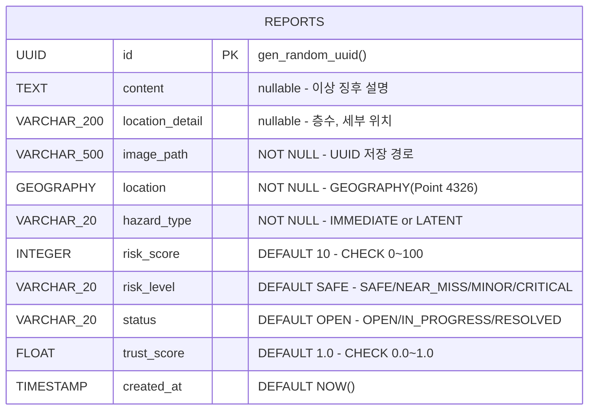

# ERD (Entity Relationship Diagram)

## reports 테이블 구조



## DDL (테이블 생성 쿼리)

```sql
CREATE TABLE reports (
    id               UUID PRIMARY KEY DEFAULT gen_random_uuid(),
    content          TEXT,
    location_detail  VARCHAR(200),
    image_path       VARCHAR(500) NOT NULL,
    location         GEOGRAPHY(Point, 4326) NOT NULL,
    hazard_type      VARCHAR(20) NOT NULL
                     CHECK (hazard_type IN ('IMMEDIATE', 'LATENT')),
    risk_score       INTEGER DEFAULT 10
                     CHECK (risk_score >= 0 AND risk_score <= 100),
    risk_level       VARCHAR(20) DEFAULT 'SAFE'
                     CHECK (risk_level IN ('SAFE', 'NEAR_MISS', 'MINOR', 'CRITICAL')),
    status           VARCHAR(20) DEFAULT 'OPEN'
                     CHECK (status IN ('OPEN', 'IN_PROGRESS', 'RESOLVED')),
    trust_score      FLOAT DEFAULT 1.0
                     CHECK (trust_score >= 0.0 AND trust_score <= 1.0),
    created_at       TIMESTAMP DEFAULT NOW()
);
```

## 인덱스

```sql
-- 공간 쿼리용 GiST 인덱스
CREATE INDEX idx_reports_location
ON reports USING GIST(location);

-- 시간 윈도우 쿼리용 인덱스
CREATE INDEX idx_reports_created_at
ON reports(created_at);

-- OPEN/IN_PROGRESS 상태 조회 최적화 (부분 인덱스)
CREATE INDEX idx_reports_open
ON reports(status)
WHERE status != 'RESOLVED';
```

## 핵심 공간 쿼리

```sql
-- LATENT: 최근 30일, RESOLVED 제외
SELECT COUNT(*) FROM reports
WHERE ST_DWithin(location, :point, 50)
AND hazard_type = 'LATENT'
AND status != 'RESOLVED'
AND created_at > NOW() - INTERVAL '30 days';

-- IMMEDIATE: OPEN 상태만
SELECT COUNT(*) FROM reports
WHERE ST_DWithin(location, :point, 50)
AND hazard_type = 'IMMEDIATE'
AND status = 'OPEN';

-- 뷰포트 필터링
SELECT * FROM reports
WHERE ST_DWithin(location, :point, :radius)
AND status != 'RESOLVED';

-- IMMEDIATE 중복 체크 (반경 10m)
SELECT COUNT(*) FROM reports
WHERE ST_DWithin(location, :point, 10)
AND hazard_type = 'IMMEDIATE'
AND status = 'OPEN';
```

## 설계 근거

- **GEOGRAPHY 타입**: 미터 단위 반경 연산을 위해 GEOMETRY 대신 사용
- **GiST 인덱스**: R-Tree 기반 공간 탐색 성능 보장
- **단일 테이블**: 외래키 복잡도 없이 공간 연산에 집중
- **CHECK 제약**: DB 레벨 데이터 무결성 보장
- **부분 인덱스**: RESOLVED 제외한 OPEN 상태 조회 최적화

## ⚠️ 트랜잭션 주의사항

제보 저장과 risk 재계산은 같은 트랜잭션 안에서 처리 필요:

```
flush → recalculate_area → commit
```

recalculate_area 실행 시 반경 50m 내 기존 OPEN 상태 제보들의
risk_score, risk_level도 Bulk Update 필요:

```sql
UPDATE reports
SET risk_score = :score,
    risk_level = :level
WHERE ST_DWithin(location, :point, 50)
AND hazard_type = 'LATENT'
AND status != 'RESOLVED'
AND created_at > NOW() - INTERVAL '30 days';
```
