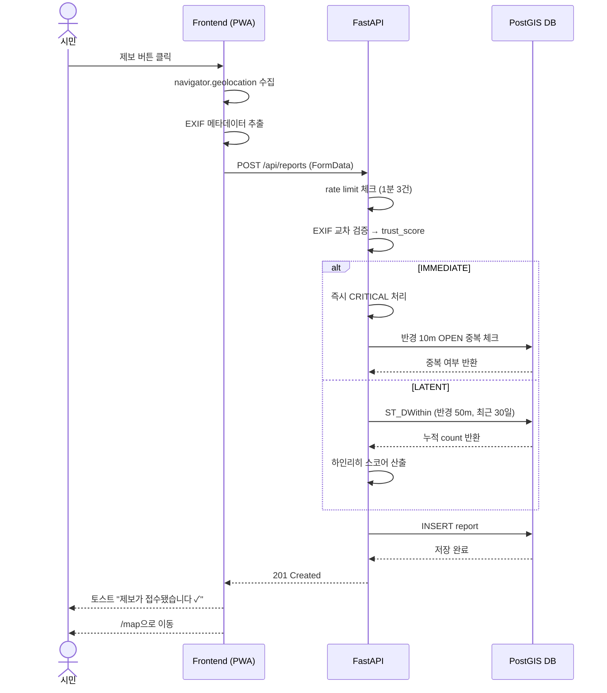
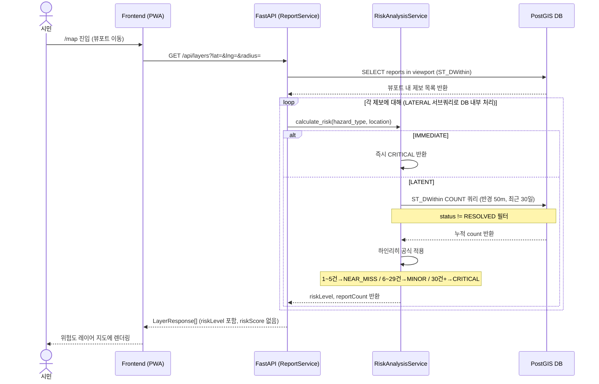
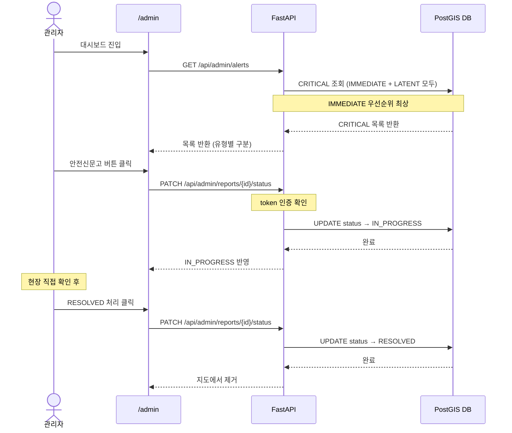
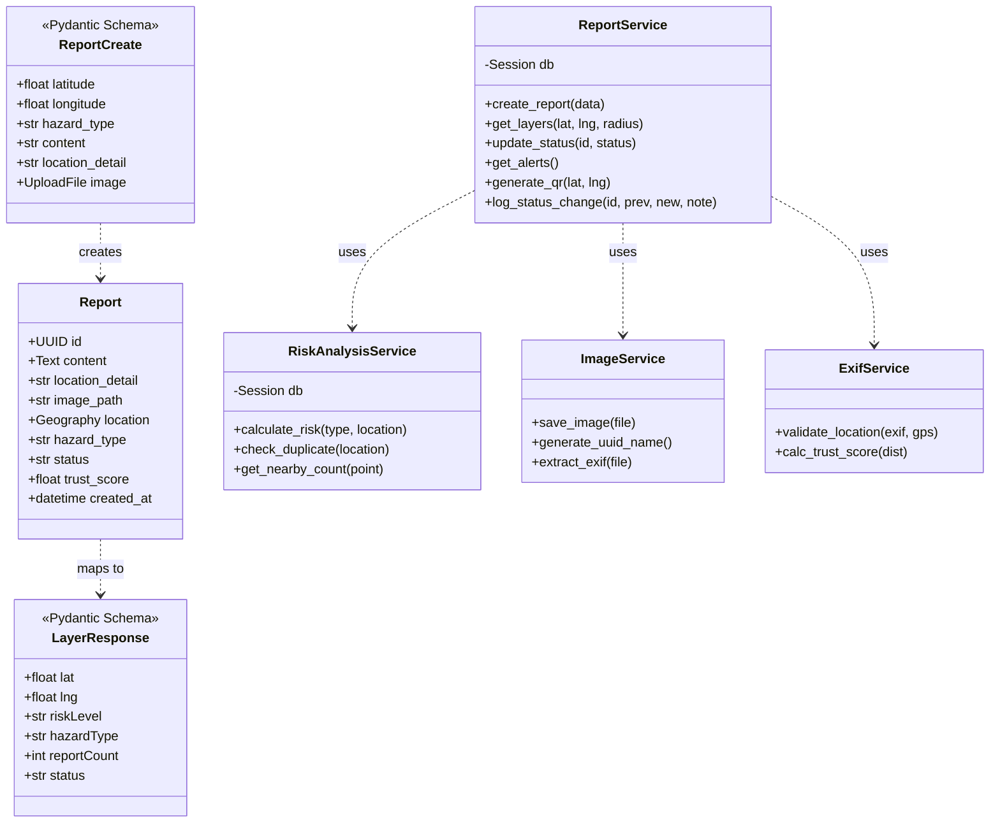

# UML 다이어그램

## 1. 시퀀스 다이어그램 - 제보 수집 흐름 (REQ-01)

```mermaid
sequenceDiagram
    actor 시민
    participant FE as Frontend (PWA)
    participant BE as FastAPI
    participant DB as PostGIS DB

    시민->>FE: 제보 버튼 클릭
    FE->>FE: navigator.geolocation 수집
    FE->>FE: EXIF 메타데이터 추출
    FE->>BE: POST /api/reports (FormData)
    BE->>BE: rate limit 체크 (1분 3건)
    BE->>BE: EXIF 교차 검증 → trust_score
    alt IMMEDIATE
        BE->>BE: 즉시 CRITICAL 처리
        BE->>DB: 반경 10m OPEN 중복 체크
        DB-->>BE: 중복 여부 반환
    else LATENT
        BE->>DB: ST_DWithin (반경 50m, 최근 30일)
        DB-->>BE: 누적 count 반환
        BE->>BE: 하인리히 스코어 산출
    end
    BE->>DB: INSERT report
    DB-->>BE: 저장 완료
    BE-->>FE: 201 Created
    FE-->>시민: 토스트 "제보가 접수됐습니다 ✓"
    FE-->>시민: /map으로 이동
```

## 2. 시퀀스 다이어그램 - 위험도 분석 흐름 (REQ-02)

```mermaid
sequenceDiagram
    actor 시민
    participant FE as Frontend (PWA)
    participant BE as FastAPI (ReportService)
    participant RA as RiskAnalysisService
    participant DB as PostGIS DB

    시민->>FE: /map 진입 (뷰포트 이동)
    FE->>BE: GET /api/layers?lat=&lng=&radius=
    BE->>DB: SELECT reports in viewport (ST_DWithin)
    DB-->>BE: 뷰포트 내 제보 목록 반환
    loop 각 제보에 대해 (LATERAL 서브쿼리로 DB 내부 처리)
        BE->>RA: calculate_risk(hazard_type, location)
        alt IMMEDIATE
            RA->>RA: 즉시 CRITICAL 반환
        else LATENT
            RA->>DB: ST_DWithin COUNT 쿼리 (반경 50m, 최근 30일)
            Note over RA,DB: status != RESOLVED 필터
            DB-->>RA: 누적 count 반환
            RA->>RA: 하인리히 공식 적용
            Note over RA: 1~5건→NEAR_MISS / 6~29건→MINOR / 30건+→CRITICAL
            RA-->>BE: riskLevel, reportCount 반환
        end
    end
    BE-->>FE: LayerResponse[] (riskLevel 포함, riskScore 없음)
    FE-->>시민: 위험도 레이어 지도에 렌더링
```

## 3. 시퀀스 다이어그램 - 관리자 조기 대응 흐름 (REQ-03)

```mermaid
sequenceDiagram
    actor 관리자
    participant AD as /admin
    participant BE as FastAPI
    participant DB as PostGIS DB

    관리자->>AD: 대시보드 진입
    AD->>BE: GET /api/admin/alerts
    BE->>DB: CRITICAL 조회 (IMMEDIATE + LATENT 모두)
    Note over BE,DB: IMMEDIATE 우선순위 최상
    DB-->>BE: CRITICAL 목록 반환
    BE-->>AD: 목록 반환 (유형별 구분)

    관리자->>AD: 안전신문고 버튼 클릭
    AD->>BE: PATCH /api/admin/reports/{id}/status
    Note over BE: token 인증 확인
    BE->>DB: UPDATE status → IN_PROGRESS
    DB-->>BE: 완료
    BE-->>AD: IN_PROGRESS 반영

    Note over 관리자: 현장 직접 확인 후
    관리자->>AD: RESOLVED 처리 클릭
    AD->>BE: PATCH /api/admin/reports/{id}/status
    BE->>DB: UPDATE status → RESOLVED
    DB-->>BE: 완료
    BE-->>AD: 지도에서 제거
```

## 4. 클래스 다이어그램

```mermaid
classDiagram
    class Report {
        +UUID id
        +Text content
        +str location_detail
        +str image_path
        +Geography location
        +str hazard_type
        +str status
        +float trust_score
        +datetime created_at
    }

    class ReportCreate {
        <<Pydantic Schema>>
        +float latitude
        +float longitude
        +str hazard_type
        +str content
        +str location_detail
        +UploadFile image
    }

    class LayerResponse {
        <<Pydantic Schema>>
        +float lat
        +float lng
        +str riskLevel
        +str hazardType
        +int reportCount
        +str status
    }

    class RiskAnalysisService {
        -Session db
        +calculate_risk(type, location)
        +check_duplicate(location)
        +get_nearby_count(point)
    }

    class ImageService {
        +save_image(file)
        +generate_uuid_name()
        +extract_exif(file)
    }

    class ExifService {
        +validate_location(exif, gps)
        +calc_trust_score(dist)
    }

    class ReportService {
        -Session db
        +create_report(data)
        +get_layers(lat, lng, radius)
        +update_status(id, status)
        +get_alerts()
        +generate_qr(lat, lng)
        +log_status_change(id, prev, new, note)
    }

    ReportService ..> RiskAnalysisService : uses
    ReportService ..> ImageService : uses
    ReportService ..> ExifService : uses
    ReportCreate ..> Report : creates
    Report ..> LayerResponse : maps to
```
